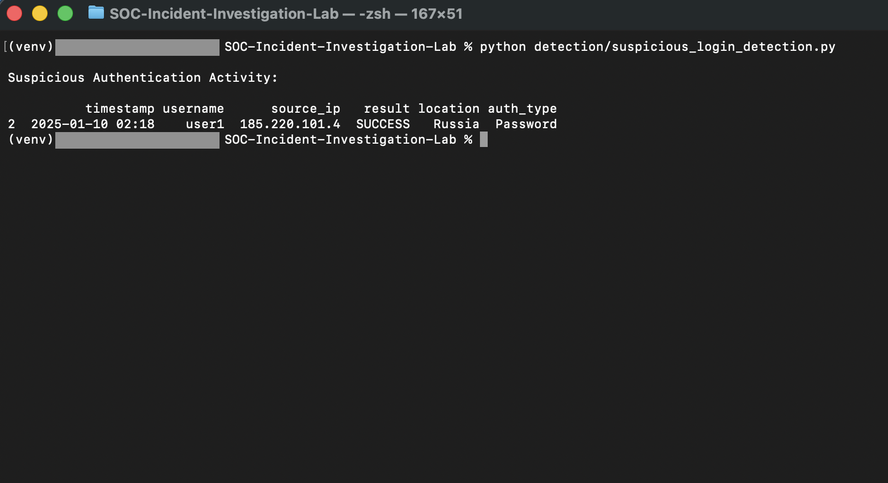
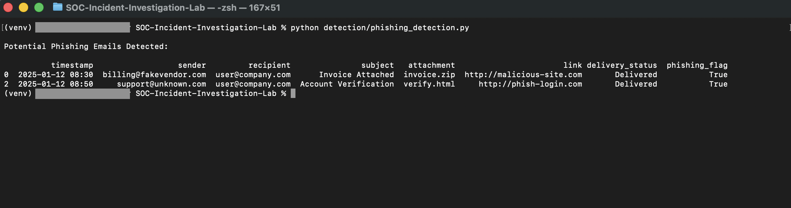
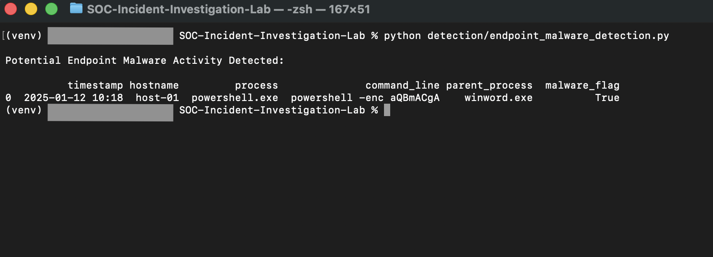
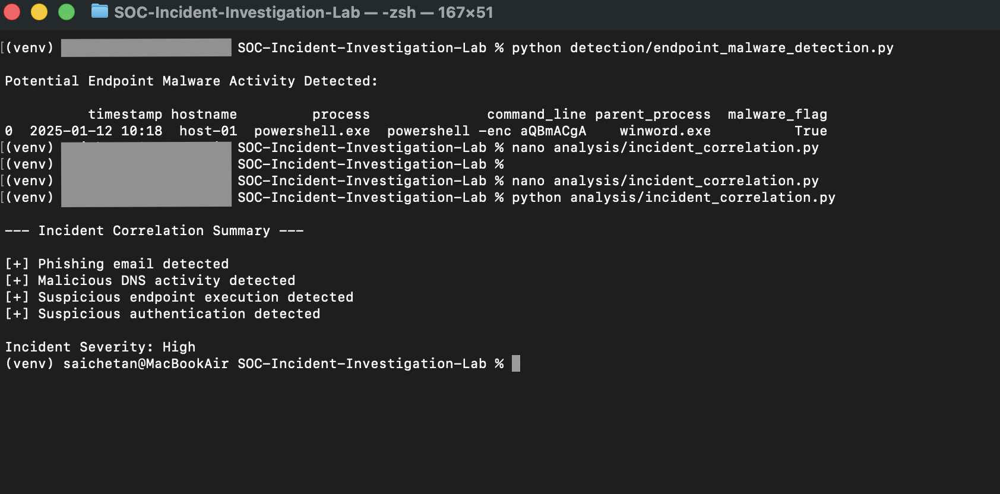

# SOC Incident Detection & Investigation Lab

## Overview
This project simulates real-world Security Operations Center (SOC) workflows with a focus on detecting, investigating, and correlating security incidents using SIEM-style log analysis. It demonstrates how a SOC analyst moves from individual alerts to a confirmed incident by analyzing authentication activity, phishing emails, DNS logs, and endpoint behavior.

The purpose of this lab is to showcase hands-on SOC Tier 1 and Tier 2 skills, including alert triage, log analysis, incident correlation, severity assessment, and audit-ready documentation.

## Skills Demonstrated
- SOC Tier 1 and Tier 2 Operations
- Security Event Monitoring and Alert Triage
- Phishing Detection and Analysis
- Authentication Log Analysis
- Endpoint and EDR Malware Detection
- DNS and Network Log Analysis
- Incident Correlation
- Severity Assessment
- Incident Reporting and Documentation
- Python for Security Automation

## Tools and Technologies
- Python
- Pandas
- Simulated SIEM Logs (Authentication, Email, DNS, Endpoint)
- MITRE ATTACK Framework
- Git and GitHub

## Project Structure

SOC-Incident-Investigation-Lab/
|
|-- logs/
|   |-- authentication_logs.csv
|   |-- email_logs.csv
|   |-- dns_logs.csv
|   |-- endpoint_logs.csv
|
|-- detection/
|   |-- suspicious_login_detection.py
|   |-- phishing_detection.py
|   |-- endpoint_malware_detection.py
|
|-- analysis/
|   |-- incident_correlation.py
|
|-- reports/
|   |-- Incident_Report_Phishing_Endpoint_Auth.md
|
|-- requirements.txt
|-- README.md

## Detection Use Cases

### Suspicious Authentication Detection
Analyzes authentication logs to identify successful logins from high-risk geolocations following multiple failed attempts, indicating possible credential compromise.

### Phishing Email Detection
Detects phishing emails based on sender reputation, suspicious attachments such as ZIP or HTML files, and malicious URLs, simulating SOC phishing triage workflows.

### Endpoint Malware Detection
Identifies suspicious endpoint activity such as encoded PowerShell execution, command-line abuse, and Office-spawned shell processes commonly seen after phishing attacks.

### Incident Correlation
Correlates phishing, DNS activity, endpoint execution, and authentication anomalies into a single confirmed security incident and assigns severity based on multiple signals.

## Incident Summary
The simulated incident involved a phishing email that led to user interaction with a malicious link, DNS resolution to a malicious domain, endpoint execution of encoded PowerShell commands, and anomalous authentication activity from a foreign location. Correlation across multiple telemetry sources confirmed a high-severity security incident.

## MITRE ATTACK Mapping
- T1566.001 - Phishing: Attachment
- T1078 - Valid Accounts
- T1059.001 - Command and Scripting Interpreter: PowerShell
- T1105 - Ingress Tool Transfer

## How to Run the Project

### Create and activate a virtual environment
python3 -m venv venv
source venv/bin/activate

### Install dependencies
python -m pip install -r requirements.txt

### Run detection scripts
python detection/suspicious_login_detection.py
python detection/phishing_detection.py
python detection/endpoint_malware_detection.py

### Run incident correlation
python analysis/incident_correlation.py

## Screenshots

Suspicious Authentication Detection  

Phishing Email Detection  

Endpoint Malware Detection  

Incident Correlation Summary  

SOC Incident Report  

## Why This Project Matters
This project mirrors how SOC analysts operate in enterprise environments by moving beyond isolated alerts to full incident investigation and documentation. It demonstrates practical experience with log analysis, detection logic, correlation, and reporting, which are critical skills for SOC Analyst and Blue Team roles.

## Author
Sai Chetan Panathukula
Security Analyst | SOC (L1 - L2) | Blue Team Analyst
